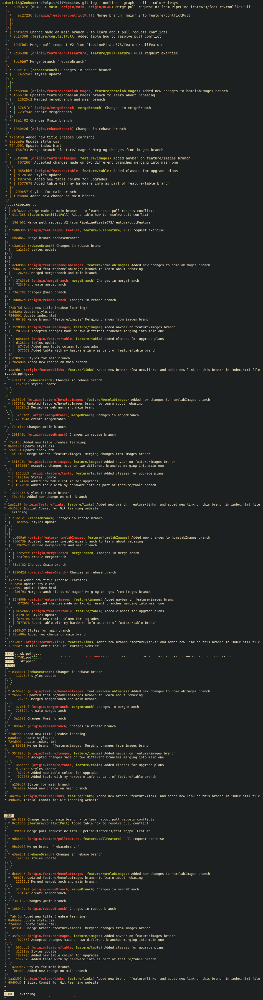

# What I Learned While Practicing Git

I wanted to get some real practice with Git instead of only reading about commands. So I created a small website and used it as my Git playground.

I started with a completely empty project and slowly added more and more things to it. Along the way I created branches, merged them, caused conflicts, broke things, fixed them and learned how Git actually behaves when multiple branches are involved.

## Starting with Git

First, I created a basic website and initialized Git:

```bash
git init
```

Then I made my first commit and pushed the project to GitHub.

After that I started making changes directly on `main`, just to get comfortable with the basic workflow:

```bash
git add .
git commit -m "My commit"
git push
```

This helped me understand the basic idea of:

```text
change something
      ↓
git add
      ↓
git commit
      ↓
git push
```

---

## Working with branches

Next, I started creating feature branches.

For example:

```bash
git switch -c feature/links
```

I made a change there, committed it and pushed the branch to GitHub.

I also learned that when pushing a new branch for the first time, Git may tell you that the branch doesn't have an upstream branch.

I got this error:

```text
fatal: The current branch feature/links has no upstream branch.
```

I fixed it with:

```bash
git push -u origin feature/links
```

That was one of those small things that makes much more sense after actually getting the error yourself.

---

## Merging branches

After working on a feature branch, I switched back to `main` and merged the feature:

```bash
git switch main
git merge feature/links
git push
```

I also created multiple branches from `main` and worked on them separately.

This helped me understand that branches are basically separate lines of development. I can work on one thing without immediately changing `main`.

---

## Seeing how branches split

One of the useful things I practiced was making changes on `main` and on a feature branch at the same time.

For example:

```text
          feature/table
         /
--------●
        \
         ● main
```

Both branches started from the same place, but then they received different commits.

I used:

```bash
git log --oneline --graph --all
```

to actually see what was happening.

This was probably one of the most useful commands during the whole exercise because it made the branch history much easier to understand.

---

## Merge conflicts

Then I intentionally created a conflict.

I changed the same part of a file differently on `main` and on a feature branch and then tried to merge them.

Git couldn't decide which version I wanted, so it stopped the merge and marked the conflicting part of the file.

I had to manually decide what I wanted to keep.

The file looked something like this:

```text
<<<<<<< HEAD
My changes from main
=======
Changes from the feature branch
>>>>>>> feature/table
```

I manually combined the changes, removed the conflict markers and then finished the merge.

After that:

```bash
git add .
git commit
git push
```

This was actually useful because now I know what a merge conflict looks like instead of just knowing that "Git conflicts exist".

---

## Fetch vs Pull

I also practiced the difference between:

```bash
git fetch
```

and:

```bash
git pull
```

For me, the easiest way to remember it is:

```text
git fetch
    ↓
check/download information about changes
    ↓
nothing is automatically changed in my working branch


git pull
    ↓
get the changes
    ↓
integrate them into my local branch
```

I also used this when working with changes that were made on GitHub.

---

## Rebase

Next came rebase.

I created a feature branch and made several commits on it while `main` was also changing.

Then I used:

```bash
git rebase main
```

I also managed to get a rebase conflict.

I had to manually fix the files and then tell Git to continue:

```bash
git add .
git rebase --continue
```

This was another good lesson because I could actually see that rebase changes the way the commit history is built.

---

## Merge vs Rebase

I also practiced using both merge and rebase and then compared the history.

This is where I made one of my mistakes.

I created `rebaseBranch`, but instead of switching back to `main`, I accidentally created `mergeBranch` from the wrong branch.

So my branches were not starting from the place I intended.

I decided to delete both branches and redo the exercise properly.

Locally:

```bash
git branch -D mergeBranch
git branch -D rebaseBranch
```

And from GitHub:

```bash
git push origin --delete mergeBranch
git push origin --delete rebaseBranch
```

Then I started the exercise again from `main`.

This was actually a useful mistake because it showed me that the branch I create matters. Git will create a new branch from wherever I currently am.

---

## Pull Requests

After getting more comfortable with branches, I moved on to Pull Requests.

I created a feature branch, made some changes and pushed it:

```bash
git push --set-upstream origin feature/pullFeature
```

Then I created the Pull Request directly on GitHub.

One thing I learned here is that a Pull Request is not a Git command.

I use Git from the terminal to create and push my branch, but the Pull Request itself is created and managed on GitHub.

After reviewing the changes, I merged the Pull Request into `main`.

I also deleted the feature branch afterwards.

---

## Pull Request with a conflict

Finally, I wanted to see what happens when a Pull Request itself has a conflict.

I created a feature branch and made changes there.

At the same time, I made another change directly on `main`.

Then I created a Pull Request:

```text
feature/conflictPull
          │
          │ Pull Request
          ▼
        main
          │
          ❌
       CONFLICT
```

GitHub couldn't automatically merge the branches.

I then updated the feature branch with the latest changes from `main`, resolved the conflict manually and pushed the result.

After that, the Pull Request could be completed.

This was probably the most useful part of the whole exercise because it combined a lot of things I had already practiced.

---

## My Git Graph

At the end, my repository history started looking something like this:

```text
*   b9d767c Merge pull request #3
|\
| *   ec27236 Merge branch 'main' into feature/conflictPull
| |\
| |/
|/
* | ebf8229 Change made on main branch
| * 0c1f368 Added table how to resolve pull conflict
|/
*   19dfb61 Merge pull request #2
|\
| * 9d8630b Pull request exercise
|/
*   0bc0b67 Merge branch 'rebaseBranch'
|\
| * e3ae1c1 Changes in rebase branch
|/
*   1a2c5a7 styles update
```

Seeing this graph makes much more sense to me now than it did at the beginning.

I can actually look at it and understand that the repository is not just one straight line. Different branches can split, receive their own commits, merge back together and sometimes conflict with each other.

---

## What I can do now

After going through all these exercises, I feel much more comfortable with the basic Git workflow.

I practiced:

* Creating a repository
* Making commits
* Working directly on `main`
* Creating feature branches
* Switching between branches
* Pushing new branches to GitHub
* Merging branches
* Working with multiple branches
* Understanding different Git histories
* Creating and resolving merge conflicts
* Using `git fetch`
* Using `git pull`
* Rebasing branches
* Comparing merge and rebase
* Creating Pull Requests
* Working with Pull Requests that contain conflicts
* Reading the Git history with `git log --oneline --graph --all`
* Cleaning up branches after merging

Most importantly, I learned that Git makes a lot more sense when you actually break something and have to fix it.

I definitely made a few mistakes during these exercises, but that's probably the best part of the whole practice. Now when Git shows me a conflict or an error, I have a much better idea of what is actually happening.


## 🌳 Git History

During my Git practice I worked with different branches, merges, rebasing and pull requests.

Here is the final Git history of the practice repository:


